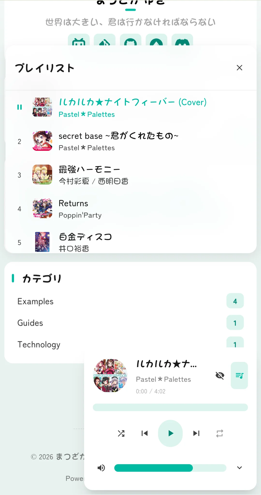

# 🌸 Mizuki


[Astro](https://astro.build) で構築された現代的で機能豊富な静的ブログテンプレートで、高度な機能と美しいデザインを特徴としています。

[](https://nodejs.org/)
[](https://pnpm.io/)
[](https://astro.build/)
[](https://www.typescriptlang.org/)
[](https://opensource.org/licenses/Apache-2.0)


[**🖥️ ライブデモ**](https://mizuki.pages.dev/) | [**📝 ドキュメント**](https://docs.mizuki.mysqil.com/)

🌏 **README 言語:**
[**English**](./README.md) / [**中文**](./README.zh.md) / [**日本語**](./README.ja.md) / [**中文繁体**](./README.tw.md) /

包括的なドキュメントですぐに始められます。テーマのカスタマイズ、機能の設定、本番環境へのデプロイなど、ブログの立ち上げに必要なすべての内容が網羅されています。

[📚 ドキュメントを読む](https://docs.mizuki.mysqil.com/) →


<table>
  <tr>
    <td></td>
    <td></td>
    <td></td>
  <tr>
  <tr>
    <td></td>
    <td></td>
    <td></td>
  <tr>
</table>

## 🚀 NEW: 自動解像度適応

> **🎯 自動解像度アルゴリズム** - デバイスの画面解像度に基づいてスマートにコンテンツレイアウトを調整し、すべてのデバイスで最適な閲覧体験を提供します

🌏 README 言語
[**English**](./README.zh.md) /
[**中文**](./README.md) /
[**日本語**](./README.ja.md) /
[**中文繁体**](./README.tw.md) /


### 🔧 コンポーネント設定システムの再構築
- **統一された設定アーキテクチャ:** 動的なコンポーネント管理と順序設定をサポートする新しいモジュール型コンポーネント設定システム
- **設定駆動型コンポーネントローディング:** 完全に設定に基づいたコンポーネントローディングメカニズムを実現したリファクタリング済みの SideBar コンポーネント
- **統一された制御スイッチ:** 音楽プレーヤーとお知らせコンポーネントの独立した有効化スイッチを削除し、sidebarLayoutConfig を介して統合的に制御
- **レスポンシブレイアウト適応:** コンポーネントはレスポンシブレイアウトをサポートし、デバイスタイプに応じて自動的に表示を調整

### 📐 レイアウトシステムの最適化
- **動的サイドバー位置調整:** 左右のサイドバー切り替えをサポートし、自動的にレイアウトを適応
- **スマート記事目次位置決め:** サイドバーが右側にある場合、記事ナビゲーションは自動的に左側に移動し、より良い閲覧体験を提供
- **グリッドレイアウトの改善:** CSS Grid レイアウトを最適化し、コンテナ幅の異常問題を解決

### 🎛️ 設定ファイルフォーマットの標準化
- **標準化された設定フォーマット:** 統一されたコンポーネント設定ファイルフォーマット仕様を作成
- **型安全性:** 包括的な TypeScript 型定義により設定の型安全性を確保
- **拡張性:** カスタムコンポーネントタイプと設定オプションをサポート

### 🧹 コード最適化
- **テストファイルのクリーンアップ:** 使用されていないテスト設定と依存関係を削除し、プロジェクトサイズを削減
- **コード構造の最適化:** コンポーネントアーキテクチャを改善し、コードの保守性を強化
- **パフォーマンスの向上:** コンポーネントローディングロジックを最適化し、ページレンダリングパフォーマンスを向上

---

## ✨ 機能

### 🎨 デザインとインターフェース
- [x] [Astro](https://astro.build) と [Tailwind CSS](https://tailwindcss.com) で構築
- [x] [Swup](https://swup.js.org/) を使用したスムーズなアニメーションとページ遷移
- [x] 明/暗テーマ切り替え（システム設定検出付き）
- [x] カスタマイズ可能なテーマカラーと動的バナーカルーセル
- [x] 全画面背景画像（カルーセル、透明度、ぼかし効果付き）
- [x] 完全レスポンシブデザイン（すべてのデバイスに対応）
- [x] JetBrains Mono フォントを使用した美しいタイポグラフィ

### 🔍 コンテンツと検索
- [x] [Pagefind](https://pagefind.app/) ベースの高度な検索機能
- [x] [拡張 Markdown 機能](#-markdown-extensions)（構文ハイライト付き）
- [x] インタラクティブな目次（自動スクロールサポート）
- [x] RSS フィード生成
- [x] 読書時間推定
- [x] 記事カテゴリとタグシステム


### 📱 特殊ページ
- [x] **アニメ追跡ページ** - アニメ視聴進捗と評価を追跡
- [x] **フレンズページ** - フレンドのウェブサイトを美しいカードで表示
- [x] **ダイアリーページ** - 生活の瞬間を共有（SNS 風）
- [x] **アーカイブページ** - 記事の順序付きタイムラインビュー
- [x] **アバウトページ** - カスタマイズ可能な自己紹介
- [x] **アルバムページ** - 美しいレイアウトの写真ギャラリー
- [x] **デバイスページ** - デバイスと機器を展示
- [x] **スキルページ** - スキルと専門知識を展示
- [x] **タイムラインページ** - イベントと経験の時系列ビュー
- [x] **プロジェクトページ** - 個人およびプロフェッショナルプロジェクトを強調表示

### 🛠 技術的特徴
- [x] **拡張コードブロック** ([Expressive Code](https://expressive-code.com/) ベース)
- [x] **数式サポート** (KaTeX レンダリング付き)
- [x] **画像最適化** (PhotoSwipe ギャラリー統合付き)
- [x] **SEO 最適化** (サイトマップとメタタグを含む)
- [x] **パフォーマンス最適化** (遅延読み込みとキャッシュ付き)
- [x] **コメントシステム** (Twikoo 統合付き)
- [x] **Mermaid チャートサポート** (フローチャートと図表作成用)
- [x] **パスワード保護** (機密コンテンツ用)
- [x] **コンテンツ分離** (チーム協作用)
- [x] **パフォーマンス監視** (Lighthouse 統合付き)
- [x] **国際化 (i18n)** (複数言語サポート)
- [x] **暗号化コンテンツ** (プライベート投稿用)
- [x] **Live2D マスコット** 統合 (Pio)

## 🚀 クイックスタート

### 📦 インストール

1. **リポジトリをクローン:**
   ```bash
   git clone https://github.com/Ruthlessa/Mizuki.git
   cd Mizuki
   ```

2. **依存関係をインストール:**
   ```bash
   # pnpm がインストールされていない場合
   npm install -g pnpm
   
   # プロジェクト依存関係をインストール
   pnpm install
   ```

3. **ブログを設定:**
   - `src/config.ts` を編集してブログ設定をカスタマイズ
   - サイト情報、テーマカラー、バナー画像、ソーシャルリンクを更新
   - 機能ページの設定を構成

4. **開発サーバーを起動:**
   ```bash
   pnpm dev
   ```
   ブログは `http://localhost:4321` で利用可能になります

### 📝 コンテンツ管理

- **新しい投稿を作成:** `pnpm new-post <ファイル名>`
- **投稿を編集:** `src/content/posts/` 内のファイルを変更
- **特殊ページをカスタマイズ:** `src/content/spec/` 内のファイルを編集
- **画像を追加:** `src/assets/` または `public/` に画像を配置

### 🚀 デプロイ

ブログを任意の静的ホスティングプラットフォームにデプロイ:

- **Vercel:** GitHub リポジトリを Vercel に接続
- **Netlify:** GitHub から直接デプロイ
- **GitHub Pages:** 付属の GitHub Actions ワークフローを使用
- **Cloudflare Pages:** リポジトリを接続

- **環境変数の設定（オプション）:** `.env.example` を参照して設定

デプロイ前に、`src/config.ts` の `siteURL` を更新してください。
**推奨されません** `.env` ファイルを Git にコミットすること。`.env` ファイルはローカルのデバッグまたはビルドにのみ使用する必要があります。クラウドプラットフォームへのデプロイの場合、プラットフォームの `環境変数` 設定を介して構成することを推奨します。

## 📝 投稿フロントマターフォーマット

```yaml
---
title: 私の最初のブログ投稿
published: 2023-09-09
description: 私の新しいブログの最初の投稿です。
image: ./cover.jpg
tags: [タグ1, タグ2]
category: フロントエンド
draft: false
pinned: false
comment: true
lang: ja      # config.ts のサイト言語と異なる場合のみ設定
---
```

### フロントマターフィールドの説明

- **title**: 記事タイトル（必須）
- **published**: 公開日（必須）
- **description**: SEO とプレビュー用の記事の説明
- **image**: カバー画像パス（記事ファイルからの相対パス）
- **tags**: カテゴリ分類用のタグ配列
- **category**: 記事カテゴリ
- **draft**: `true` に設定すると本番環境で記事を非表示に
- **pinned**: `true` に設定すると記事をトップに固定
- **comment**: `true` に設定すると記事のコメント機能を有効化（グローバルコメント機能が有効化されている必要があります）
- **lang**: 記事の言語（サイトのデフォルト言語と異なる場合のみ設定）

### 記事固定機能

`pinned` フィールドを使用すると、重要な記事をブログリストのトップに固定できます。固定された記事は、公開日に関係なく常に通常の記事の前に表示されます。

**使用方法:**
```yaml
pinned: true  # この記事をトップに固定
pinned: false # 通常の記事（デフォルト）
```

**並べ替え規則:**
1. 固定された記事が最初に表示され、公開日で並べ替え（最新優先）
2. 通常の記事が続いて表示され、公開日で並べ替え（最新優先）

### 記事レベルのコメント制御

`comment` フィールドを使用すると、各記事ごとにコメント機能の有効/無効を個別に制御できます。

**使用方法:**
```yaml
comment: true  # コメントを有効化（デフォルト）
comment: false # コメントを無効化
```

**注意:**
この機能を使用するには、まず `src/config.ts` でコメントシステムを有効化する必要があります。

## 🧩 Markdown 拡張機能

Mizuki は標準的な GitHub Flavored Markdown を超える拡張機能をサポートしています:

### 📝 拡張ライティング
- **コールアウト:** `> [!NOTE]`、`> [!TIP]`、`> [!WARNING]` などを使用して美しい注釈ボックスを作成
- **数式:** `$インライン$` と `$$ブロック$$` 構文を使用して LaTeX 数式を記述
- **コードハイライト:** 行番号とコピーボタン付きの高度な構文ハイライト
- **GitHub カード:** `::github{repo="user/repo"}` を使用してリポジトリカードを埋め込む
- **Mermaid ダイアグラム:** ````mermaid``` コードブロックを使用してフローチャートと図表を作成

### 🎨 ビジュアル要素
- **画像ギャラリー:** 画像表示用の自動 PhotoSwipe 統合
- **折りたたみ可能なセクション:** 展開可能なコンテンツブロックを作成
- **カスタムコンポーネント:** 特殊なディレクティブを使用してコンテンツを強化

### 📊 コンテンツ組織
- **目次:** 見出しから自動生成（スムーズスクロール付き）
- **読書時間:** 自動計算と表示
- **記事メタデータ:** 豊富なフロントマターサポート（カテゴリとタグ付き）

## ⚡ コマンド

すべてのコマンドはプロジェクトルートから実行します:

| コマンド                    | アクション                                   |
|:---------------------------|:-----------------------------------------|
| `pnpm install`             | 依存関係をインストール                     |
| `pnpm dev`                 | ローカル開発サーバーを `localhost:4321` で起動 |
| `pnpm build`               | アニメーション更新、Pagefind インデックス、フォント圧縮を含む本番サイトをビルド |
| `pnpm preview`             | デプロイ前にローカルでビルドをプレビュー  |
| `pnpm check`               | Astro エラーチェックを実行                 |
| `pnpm format`              | Prettier でコードをフォーマット                   |
| `pnpm lint`                | コードの問題をチェックして修正                |
| `pnpm new-post <filename>` | 新しいブログ投稿を作成                   |
| `pnpm sync-content`        | 外部リポジトリのコンテンツを同期     |
| `pnpm update-anime`        | アニメデータを更新                        |
| `pnpm update-bangumi`      | アニメデータを更新                      |
| `pnpm update-bilibili`     | Bilibili データを更新                     |
| `pnpm compress-fonts`      | フォントファイルを圧縮                      |
| `pnpm type-check`          | TypeScript 型チェックを実行             |
| `pnpm astro ...`           | Astro CLI コマンドを実行                   |

## 🎯 設定ガイド

### 🔧 基本設定

`src/config.ts` を編集してブログをカスタマイズ:

```typescript
export const siteConfig: SiteConfig = {
  title: "あなたのブログ名",
  subtitle: "あなたのブログの説明",
  lang: "ja", // または "zh-CN", "en" など
  themeColor: {
    hue: 210, // 0-360、テーマの色相
    fixed: false, // テーマカラーピッカーを非表示
  },
  banner: {
    enable: true,
    src: ["assets/banner/1.webp"], // バナー画像
    carousel: {
      enable: true,
      interval: 0.8, // 秒
    },
  },
};
```

### 📱 機能ページの設定

- **アニメページ:** `src/pages/anime.astro` でアニメリストを編集
- **フレンズページ:** `src/content/spec/friends.md` でフレンズデータを編集
- **ダイアリーページ:** `src/pages/diary.astro` で瞬間を編集
- **アバウトページ:** `src/content/spec/about.md` でコンテンツを編集
- **アルバムページ:** `public/images/albums/` に写真ギャラリーを追加
- **デバイスページ:** `src/data/devices.ts` でデバイスデータを編集
- **スキルページ:** `src/data/skills.ts` でスキルデータを編集
- **タイムラインページ:** `src/data/timeline.ts` でタイムラインデータを編集
- **プロジェクトページ:** `src/data/projects.ts` でプロジェクトデータを編集

### 📦 コード-コンテンツ分離（オプション）

Mizuki はコードとコンテンツを2つの独立したリポジトリに分離することをサポートしており、チーム協力と大規模プロジェクトに適しています。

**クイック選択:**

| 使用シナリオ | 設定 | 対象者 |
|---------|---------|---------|
| 🆕 **ローカルモード**（デフォルト） | 設定不要、直接使用 | 初心者、個人ブログ |
| 🔧 **分離モード** | `ENABLE_CONTENT_SYNC=true` に設定 | チーム協力、プライベートコンテンツ |

**ワンクリックで有効/無効:**

```bash
# 方法 1：ローカルモード（初心者に推奨）
# .env ファイルを作成する必要はなく、直接実行
pnpm dev

# 方法 2：コンテンツ分離モード
# 1. 設定ファイルをコピー
cp .env.example .env

# 2. .env を編集してコンテンツ分離を有効化
ENABLE_CONTENT_SYNC=true
CONTENT_REPO_URL=https://github.com/your-username/Mizuki-Content.git

# 3. コンテンツを同期
pnpm run sync-content
```

**機能:**
- ✅ 公開およびプライベートリポジトリをサポート 🔐
- ✅ ワンクリックで有効/無効、コード変更不要
- ✅ 自動同期、開発前に最新コンテンツを自動的に取得

📖 **詳細設定:** [コンテンツ分離ガイド](docs/CONTENT_SEPARATION.md)
🔄 **移行チュートリアル:** [単一リポジトリから分離モードへの移行](docs/MIGRATION_GUIDE.md)
📚 **その他のドキュメント:** [ドキュメント索引](docs/README.md)

## ✏️ 貢献

貢献を歓迎します！問題やプルリクエストをいつでも送信してください。

1. リポジトリをフォーク
2. 機能ブランチを作成 (`git checkout -b feature/amazing-feature`)
3. 変更をコミット (`git commit -m 'Add some amazing feature'`)
4. ブランチにプッシュ (`git push origin feature/amazing-feature`)
5. Pull Request を開く

## 📄 ライセンス

このプロジェクトは Apache License 2.0 のもとでライセンスされています - [LICENSE](LICENSE) ファイルを参照してください。

### 元のプロジェクトライセンス

このプロジェクトは [Fuwari](https://github.com/saicaca/fuwari) に基づいており、MIT License を使用しています。MIT License の要求に従い、元の著作権表示とライセンス表示は LICENSE.MIT ファイルに含まれています。

## 🙏 謝辞

- [Mizuki](https://github.com/Ruthlessa/Mizuki) テーマに基づく
- [Yukina](https://github.com/WhitePaper233/yukina) にインスピレーションを受ける - 美しくエレガントなブログテンプレート
- いくつかのデザインインスピレーションは [Firefly](https://github.com/CuteLeaf/Firefly) と [Twilight](https://github.com/spr-aachen/Twilight) テンプレートから
- かわいい Live2D マスコットプラグインのために [Pio](https://github.com/Dreamer-Paul/Pio) を使用
- [Astro](https://astro.build) と [Tailwind CSS](https://tailwindcss.com) で構築
- アイコンは [Iconify](https://iconify.design/) から

### 🌸 特別感謝

- **[Mizuki](https://github.com/Ruthlessa/Mizuki)** - このブログで使用されているテーマ。
- **[Yukina](https://github.com/WhitePaper233/yukina)** - このプロジェクトの形成に役立ったデザインインスピレーションと創造性を提供してくれてありがとう。Yukina は優れたデザイン原則とユーザーエクスペリエンスを示すエレガントなブログテンプレートです。
- **[Firefly](https://github.com/CuteLeaf/Firefly)** - 優れたレイアウトデザインのアイデアを提供してくれてありがとう。デュアルサイドバーレイアウト、記事のデュアルカラムグリッドレイアウト、いくつかのウィジェットデザインと実装により、Mizuki のインターフェースが豊かになりました。
- **[Twilight](https://github.com/spr-aachen/Twilight)** - インスピレーションと技術的サポートを提供してくれてありがとう。Twilight の動的壁紙モード切り替えシステム、レスポンシブデザイン、およびトランジション効果により、Mizuki のユーザーエクスペリエンスが大幅に強化されました。

## 🍀 貢献者

このプロジェクトへの貢献者の皆様に感謝します。問題や提案がある場合は、[Issue](https://github.com/Ruthlessa/Mizuki/issues) または [Pull Request](https://github.com/Ruthlessa/Mizuki/pulls) を送信してください。

<a href="https://github.com/Ruthlessa/Mizuki/graphs/contributors">
  
</a>

## ⭐ Star History

[](https://star-history.com/#Ruthlessa/Mizuki&Date)

⭐ このプロジェクトが役に立った場合は、スターをつけてください！
