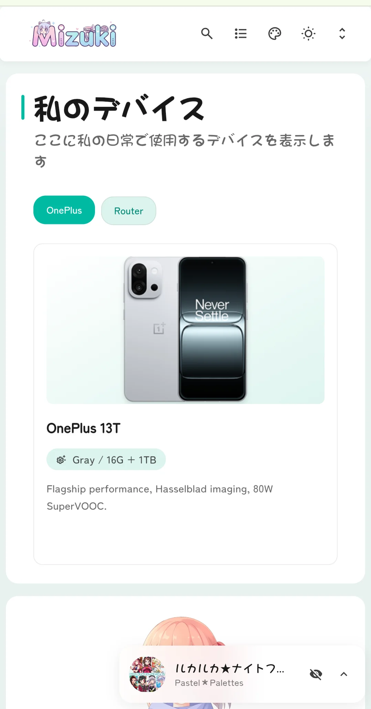
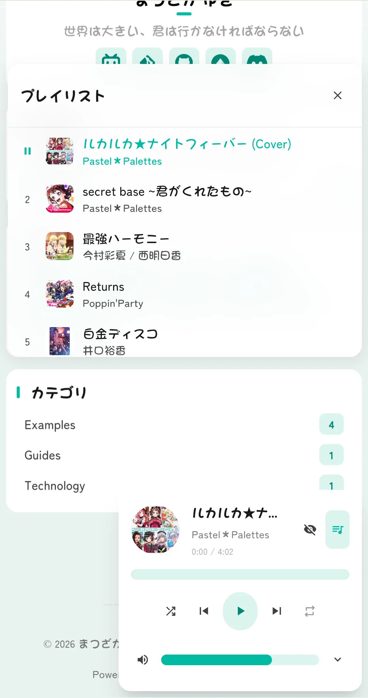

# 🌸 Mizuki 


一个现代化、功能丰富的静态博客模板，使用 [Astro](https://astro.build) 构建，具有先进的功能和美丽的设计。

[](https://nodejs.org/)
[](https://pnpm.io/)
[](https://astro.build/)
[](https://www.typescriptlang.org/)
[](https://opensource.org/licenses/Apache-2.0)

[**🖥️ 在线演示**](https://mizuki.pages.dev/) | [**📝 文档**](https://docs.mizuki.mysqil.com/)

🌏 **README 语言：**
[**English**](./README.md) / [**中文**](./README.zh.md) / [**日本語**](./README.ja.md) / [**中文繁体**](./README.tw.md) /

通过我们全面的文档快速开始。无论您是自定义主题、配置功能还是部署到生产环境，文档都涵盖了成功启动博客所需的一切。

[📚 阅读完整文档](https://docs.mizuki.mysqil.com/) →


<table>
  <tr>
    <td></td>
    <td></td>
    <td></td>
  <tr>
  <tr>
    <td></td>
    <td></td>
    <td></td>
  <tr>
</table>

## 🚀 新功能：自动分辨率适配

> **🎯 自动分辨率算法** - 智能根据设备屏幕分辨率调整内容布局，为所有设备提供最佳观看体验

🌏 README 语言
[**English**](./README.md) /
[**中文**](./README.zh.md) /
[**日本語**](./README.ja.md) /
[**中文繁体**](./README.tw.md) /


### 🔧 组件配置系统重构
- **统一配置架构：** 全新的模块化组件配置系统，支持动态组件管理和顺序配置
- **配置驱动的组件加载：** 重构的 SideBar 组件，实现完全基于配置的组件加载机制
- **统一控制开关：** 移除了音乐播放器和公告组件的独立启用开关，通过 sidebarLayoutConfig 统一控制
- **响应式布局适配：** 组件支持响应式布局，根据设备类型自动调整显示

### 📐 布局系统优化
- **动态侧边栏位置调整：** 支持左右侧边栏切换，自动布局适配
- **智能文章目录定位：** 当侧边栏在右侧时，文章导航自动移至左侧，提供更好的阅读体验
- **网格布局改进：** 优化了 CSS Grid 布局，解决容器宽度异常问题

### 🎛️ 配置文件格式标准化
- **标准化配置格式：** 创建统一的组件配置文件格式规范
- **类型安全：** 全面的 TypeScript 类型定义确保配置类型安全
- **可扩展性：** 支持自定义组件类型和配置选项

### 🧹 代码优化
- **测试文件清理：** 移除未使用的测试配置和依赖，减少项目大小
- **代码结构优化：** 改进组件架构，增强代码可维护性
- **性能提升：** 优化组件加载逻辑，提高页面渲染性能

---

## ✨ 特性

### 🎨 设计与界面
- [x] 使用 [Astro](https://astro.build) 和 [Tailwind CSS](https://tailwindcss.com) 构建
- [x] 使用 [Swup](https://swup.js.org/) 实现平滑动画和页面过渡
- [x] 支持亮色/暗色主题切换，带系统偏好检测
- [x] 可自定义主题颜色和动态横幅轮播
- [x] 全屏背景图片，带轮播、透明度和模糊效果
- [x] 完全响应式设计，适配所有设备
- [x] 使用 JetBrains Mono 字体的精美排版

### 🔍 内容与搜索
- [x] 基于 [Pagefind](https://pagefind.app/) 的高级搜索功能
- [x] [增强的 Markdown 功能](#-markdown-extensions)，带语法高亮
- [x] 交互式目录，支持自动滚动
- [x] RSS 订阅源生成
- [x] 阅读时间估算
- [x] 文章分类和标签系统


### 📱 特殊页面
- [x] **动画追踪页面** - 追踪动画观看进度和评分
- [x] **好友页面** - 展示好友网站的精美卡片
- [x] **日记页面** - 分享生活瞬间，类似社交媒体
- [x] **归档页面** - 文章的有序时间线视图
- [x] **关于页面** - 可自定义的个人介绍
- [x] **相册页面** - 带有精美布局的照片画廊
- [x] **设备页面** - 展示您的设备和装备
- [x] **技能页面** - 展示您的技能和专业知识
- [x] **时间线页面** - 事件和经历的时间顺序视图
- [x] **项目页面** - 突出您的个人和专业项目

### 🛠 技术特性
- [x] **增强的代码块** 基于 [Expressive Code](https://expressive-code.com/)
- [x] **数学公式支持** 带 KaTeX 渲染
- [x] **图片优化** 带 PhotoSwipe 画廊集成
- [x] **SEO 优化** 包括站点地图和元标签
- [x] **性能优化** 带懒加载和缓存
- [x] **评论系统** 带 Twikoo 集成
- [x] **Mermaid 图表支持** 用于创建流程图和图表
- [x] **密码保护** 用于敏感内容
- [x] **内容分离** 用于团队协作
- [x] **性能监控** 带 Lighthouse 集成
- [x] **国际化 (i18n)** 支持多语言
- [x] **加密内容** 支持私人帖子
- [x] **Live2D 吉祥物** 集成 (Pio)

## 🚀 快速开始

### 📦 安装

1. **克隆仓库：**
   ```bash
   git clone https://github.com/Ruthlessa/Mizuki.git
   cd Mizuki
   ```

2. **安装依赖：**
   ```bash
   # 如果尚未安装 pnpm
   npm install -g pnpm
   
   # 安装项目依赖
   pnpm install
   ```

3. **配置您的博客：**
   - 编辑 `src/config.ts` 来自定义博客设置
   - 更新站点信息、主题颜色、横幅图片和社交链接
   - 配置功能页面功能

4. **启动开发服务器：**
   ```bash
   pnpm dev
   ```
   您的博客将在 `http://localhost:4321` 可用

### 📝 内容管理

- **创建新帖子：** `pnpm new-post <文件名>`
- **编辑帖子：** 修改 `src/content/posts/` 中的文件
- **自定义特殊页面：** 编辑 `src/content/spec/` 中的文件
- **添加图片：** 将图片放在 `src/assets/` 或 `public/` 中

### 🚀 部署

将您的博客部署到任何静态托管平台：

- **Vercel：** 将您的 GitHub 仓库连接到 Vercel
- **Netlify：** 直接从 GitHub 部署
- **GitHub Pages：** 使用包含的 GitHub Actions 工作流
- **Cloudflare Pages：** 连接您的仓库

- **环境变量配置（可选）：** 参考 `.env.example` 进行配置

部署前，请更新 `src/config.ts` 中的 `siteURL`。
**不建议** 将 `.env` 文件提交到 Git。`.env` 文件应仅用于本地调试或构建。对于云平台部署，建议通过平台的 `环境变量` 设置进行配置。

## 📝 帖子前置元数据格式

```yaml
---
title: 我的第一篇博客文章
published: 2023-09-09
description: 这是我的新博客的第一篇文章。
image: ./cover.jpg
tags: [标签1, 标签2]
category: 前端
draft: false
pinned: false
comment: true
lang: en      # 仅当文章语言与 config.ts 中的站点语言不同时设置
---
```

### 前置元数据字段说明

- **title**：文章标题（必填）
- **published**：发布日期（必填）
- **description**：文章描述，用于 SEO 和预览
- **image**：封面图片路径（相对于文章文件）
- **tags**：用于分类的标签数组
- **category**：文章分类
- **draft**：设置为 `true` 可在生产环境中隐藏文章
- **pinned**：设置为 `true` 可将文章固定到顶部
- **comment**：设置为 `true` 可启用文章评论区（需要全局评论功能已启用）
- **lang**：文章语言（仅当与站点默认语言不同时设置）

### 固定文章功能

`pinned` 字段允许您将重要文章固定到博客列表的顶部。固定文章将始终出现在普通文章之前，无论其发布日期如何。

**使用方法：**
```yaml
pinned: true  # 将此文章固定到顶部
pinned: false # 普通文章（默认）
```

**排序规则：**
1. 固定文章首先出现，按发布日期排序（最新优先）
2. 普通文章随后出现，按发布日期排序（最新优先）

### 文章级评论控制

`comment` 字段允许您为每篇文章单独控制评论区的启用和禁用。

**使用方法：**
```yaml
comment: true  # 启用评论（默认）
comment: false # 禁用评论
```

**注意：**
此功能需要首先在 `src/config.ts` 中启用评论系统。

## 🧩 Markdown 扩展

Mizuki 支持超出标准 GitHub 风格 Markdown 的增强功能：

### 📝 增强写作
- **标注：** 使用 `> [!NOTE]`、`> [!TIP]`、`> [!WARNING]` 等创建精美的注释框
- **数学公式：** 使用 `$inline$` 和 `$$block$$` 语法编写 LaTeX 数学公式
- **代码高亮：** 带行号和复制按钮的高级语法高亮
- **GitHub 卡片：** 使用 `::github{repo="user/repo"}` 嵌入仓库卡片
- **Mermaid 图表：** 使用 ````mermaid` 代码块创建流程图和图表

### 🎨 视觉元素
- **图片画廊：** 用于图片查看的自动 PhotoSwipe 集成
- **可折叠部分：** 创建可展开的内容块
- **自定义组件：** 使用特殊指令增强内容

### 📊 内容组织
- **目录：** 从标题自动生成，带平滑滚动
- **阅读时间：** 自动计算并显示
- **文章元数据：** 丰富的前置元数据支持，带分类和标签

## ⚡ 命令

所有命令都从项目根目录运行：

| 命令                    | 操作                                   |
|:---------------------------|:-----------------------------------------|
| `pnpm install`             | 安装依赖                     |
| `pnpm dev`                 | 在 `localhost:4321` 启动本地开发服务器 |
| `pnpm build`               | 构建生产站点，包含动画更新、Pagefind 索引和字体压缩 |
| `pnpm preview`             | 在部署前本地预览构建  |
| `pnpm check`               | 运行 Astro 错误检查                 |
| `pnpm format`              | 使用 Prettier 格式化代码                   |
| `pnpm lint`                | 检查并修复代码问题                |
| `pnpm new-post <filename>` | 创建新博客文章                   |
| `pnpm sync-content`        | 同步外部仓库内容     |
| `pnpm update-anime`        | 更新动画数据                        |
| `pnpm update-bangumi`      | 更新番剧数据                      |
| `pnpm update-bilibili`     | 更新哔哩哔哩数据                     |
| `pnpm compress-fonts`      | 压缩字体文件                      |
| `pnpm type-check`          | 运行 TypeScript 类型检查             |
| `pnpm astro ...`           | 运行 Astro CLI 命令                   |

## 🎯 配置指南

### 🔧 基本配置

编辑 `src/config.ts` 来自定义您的博客：

```typescript
export const siteConfig: SiteConfig = {
  title: "您的博客名称",
  subtitle: "您的博客描述",
  lang: "zh-CN", // 或 "en", "ja" 等
  themeColor: {
    hue: 210, // 0-360，主题色调
    fixed: false, // 隐藏主题颜色选择器
  },
  banner: {
    enable: true,
    src: ["assets/banner/1.webp"], // 横幅图片
    carousel: {
      enable: true,
      interval: 0.8, // 秒
    },
  },
};
```

### 📱 功能页面配置

- **动画页面：** 在 `src/pages/anime.astro` 中编辑动画列表
- **好友页面：** 在 `src/content/spec/friends.md` 中编辑好友数据
- **日记页面：** 在 `src/pages/diary.astro` 中编辑瞬间
- **关于页面：** 在 `src/content/spec/about.md` 中编辑内容
- **相册页面：** 在 `public/images/albums/` 中添加照片画廊
- **设备页面：** 在 `src/data/devices.ts` 中编辑设备数据
- **技能页面：** 在 `src/data/skills.ts` 中编辑技能数据
- **时间线页面：** 在 `src/data/timeline.ts` 中编辑时间线数据
- **项目页面：** 在 `src/data/projects.ts` 中编辑项目数据

### 📦 代码-内容分离（可选）

Mizuki 支持将代码和内容分离到两个独立的仓库中，适用于团队协作和大型项目。

**快速选择：**

| 使用场景 | 配置 | 适用人群 |
|---------|---------|---------|
| 🆕 **本地模式**（默认） | 无需配置，直接使用 | 初学者，个人博客 |
| 🔧 **分离模式** | 设置 `ENABLE_CONTENT_SYNC=true` | 团队协作，私人内容 |

**一键启用/禁用：**

```bash
# 方法 1：本地模式（推荐给初学者）
# 无需创建 .env 文件，直接运行
pnpm dev

# 方法 2：内容分离模式
# 1. 复制配置文件
cp .env.example .env

# 2. 编辑 .env 启用内容分离
ENABLE_CONTENT_SYNC=true
CONTENT_REPO_URL=https://github.com/your-username/Mizuki-Content.git

# 3. 同步内容
pnpm run sync-content
```

**特性：**
- ✅ 支持公共和私人仓库 🔐
- ✅ 一键启用/禁用，无需代码修改
- ✅ 自动同步，在开发前自动拉取最新内容

📖 **详细配置：** [内容分离指南](docs/CONTENT_SEPARATION.md)
🔄 **迁移教程：** [从单一仓库迁移到分离模式](docs/MIGRATION_GUIDE.md)
📚 **更多文档：** [文档索引](docs/README.md)

## ✏️ 贡献


欢迎贡献！随时提交问题和拉取请求。

1. Fork 仓库
2. 创建功能分支 (`git checkout -b feature/amazing-feature`)
3. 提交更改 (`git commit -m 'Add some amazing feature'`)
4. 推送到分支 (`git push origin feature/amazing-feature`)
5. 打开 Pull Request

## 📄 许可证

本项目采用 Apache License 2.0 许可证 - 详见 [LICENSE](LICENSE) 文件。

### 原始项目许可证

本项目基于 [Fuwari](https://github.com/saicaca/fuwari)，该项目采用 MIT 许可证。原始版权声明和许可声明已包含在 LICENSE.MIT 文件中，符合 MIT 许可证要求。

## 🙏 致谢

- 基于 [Mizuki](https://github.com/Ruthlessa/Mizuki) 主题
- 灵感来自 [Yukina](https://github.com/WhitePaper233/yukina) - 一个美丽优雅的博客模板
- 一些设计灵感来自 [Firefly](https://github.com/CuteLeaf/Firefly) 和 [Twilight](https://github.com/spr-aachen/Twilight) 模板
- 使用 [Pio](https://github.com/Dreamer-Paul/Pio) 实现可爱的 Live2D 吉祥物插件
- 使用 [Astro](https://astro.build) 和 [Tailwind CSS](https://tailwindcss.com) 构建
- 图标来自 [Iconify](https://iconify.design/)

### 🌸 特别感谢

- **[Mizuki](https://github.com/Ruthlessa/Mizuki)** - 本博客使用的主题。
- **[Yukina](https://github.com/WhitePaper233/yukina)** - 感谢提供设计灵感和创意，帮助塑造了这个项目。Yukina 是一个优雅的博客模板，展示了优秀的设计原则和用户体验。
- **[Firefly](https://github.com/CuteLeaf/Firefly)** - 感谢提供优秀的布局设计思路。双侧边栏布局、文章双列网格布局以及一些小部件设计和实现丰富了 Mizuki 的界面。
- **[Twilight](https://github.com/spr-aachen/Twilight)** - 感谢提供灵感和技术支持。Twilight 的动态壁纸模式切换系统、响应式设计和过渡效果极大地增强了 Mizuki 的用户体验。
