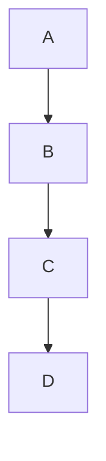
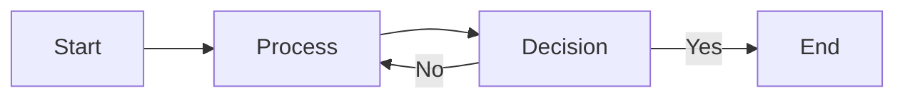
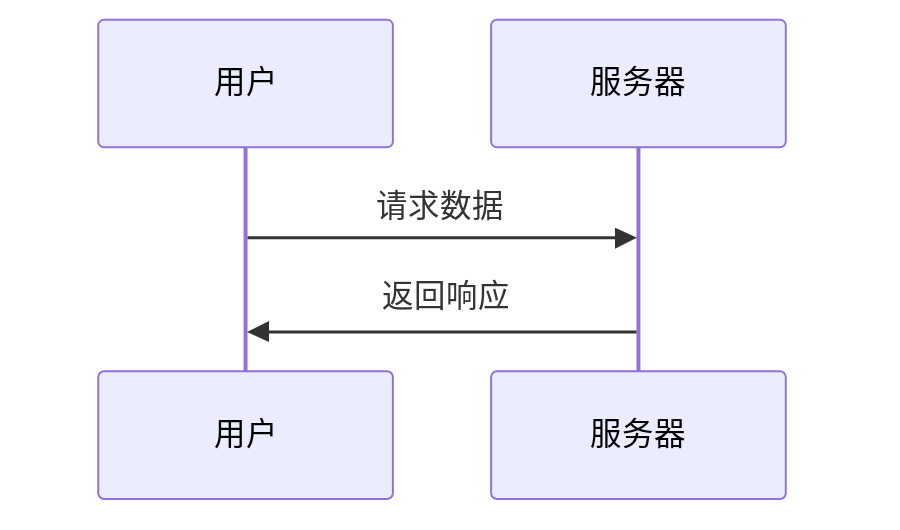
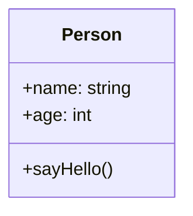

# Markdown

## 基本语法

### 标题

```markdown
# 一级标题
## 二级标题
### 三级标题
#### 四级标题
##### 五级标题
###### 六级标题
```

### 段落

普通文本即为段落，段落之间需要空一行。

### 换行

在行尾添加两个空格或使用 `<br>` 标签。

### 强调

```markdown
*斜体文本*
_斜体文本_
**粗体文本**
__粗体文本__
***粗体斜体***
___粗体斜体___
```

### 删除线

```markdown
~~删除的文本~~
```

### 引用

```markdown
> 这是一段引用
> 
> 引用可以有多行
```

### 列表

#### 无序列表

```markdown
- 项目一
- 项目二
- 项目三
```

#### 有序列表

```markdown
1. 第一步
2. 第二步
3. 第三步
```

#### 嵌套列表

```markdown
- 主项目
  - 子项目
  - 子项目
    - 孙项目
```

### 代码

#### 行内代码

```markdown
`const x = 1;`
```

#### 代码块

```markdown
```javascript
function hello() {
  console.log('Hello');
}
```
```

### 链接

```markdown
[链接文本](https://example.com)
[链接文本](https://example.com "标题")
```

### 图片

```markdown


```

### 表格

```markdown
| 列1 | 列2 | 列3 |
|-----|-----|-----|
| 内容 | 内容 | 内容 |
| 内容 | 内容 | 内容 |
```

### 分割线

```markdown
---
***
___
```

### 任务列表

```markdown
- [x] 完成任务
- [ ] 未完成任务
- [ ] 待办任务
```

### 脚注

```markdown
这是一段带有脚注的文本[^1]。

[^1]: 脚注内容
```

### 定义列表

```markdown
术语
: 定义说明
```

## 扩展语法

### 代码块高亮

支持多种编程语言：

```markdown
```typescript
const message: string = 'Hello';
```

```python
print("Hello World")
```

```rust
fn main() {
    println!("Hello");
}
```
```

### 代码块选项

#### 行号显示

```markdown
```javascript
// 行号会自动显示
console.log('Hello');
```
```

#### 高亮行

```markdown
```javascript {2-3}
function hello() {
  console.log('Hello');
  return true;
}
```
```

### 数学公式

使用 KaTeX 渲染数学公式：

```markdown
$$E = mc^2$$
```

行内公式：

```markdown
爱因斯坦的质能方程是 $E = mc^2$。
```

### 图表支持

使用 Mermaid 绘制图表：

```markdown

```

### 流程图

```markdown

```

### 时序图

```markdown

```

### 类图

```markdown

```

## 私有语法

### GitHub 卡片

```markdown

```

### 链接卡片

```markdown

```

### 高亮提示

```markdown

这是一条提示信息



这是一条警告信息



这是一条危险信息

```

### 折叠内容

```markdown

隐藏的内容

```

### 视频嵌入

#### Bilibili

```markdown

```

#### YouTube

```markdown

```

### 音乐嵌入

```markdown

```

### 代码折叠

```markdown
```javascript
// 点击代码块右上角的箭头折叠
function longFunction() {
  // 很多代码...
}
```
```

## 最佳实践

### 标题层级

- 使用 `#` 作为页面主标题
- 文章内容从 `##` 开始
- 保持层级结构清晰

### 代码风格

- 使用正确的语言标识
- 保持代码缩进一致
- 添加必要的注释

### 图片优化

- 使用 WebP 格式
- 添加合适的 alt 文本
- 压缩图片大小

### 链接管理

- 使用相对路径
- 定期检查链接有效性
- 添加链接标题

### 标签使用

- 标签数量控制在 3-5 个
- 使用有意义的标签名称
- 保持标签一致性