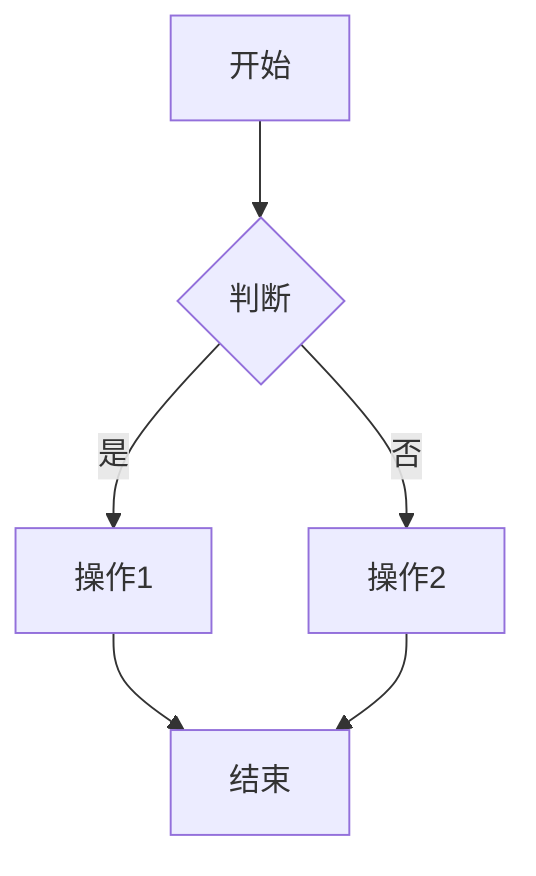
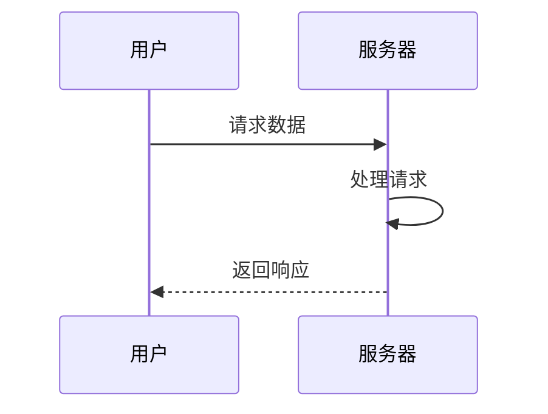
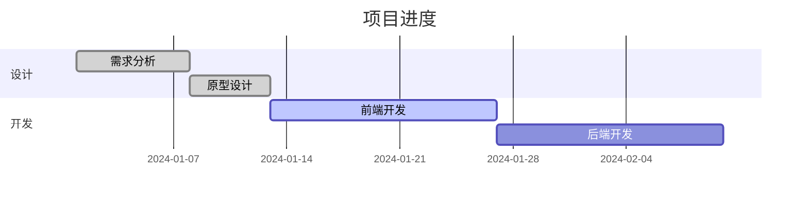

# 私有语法

## GitHub 卡片

### 基本用法

```markdown

```

### 示例

```markdown

```

### 显示效果

会显示一个带有仓库信息的卡片，包含：
- 仓库名称
- 描述
- Star 数量
- Fork 数量
- 编程语言
- 最后更新时间

## 链接卡片

### 基本用法

```markdown

```

### 参数说明

| 参数 | 类型 | 必填 | 说明 |
|------|------|------|------|
| 标题 | string | 是 | 链接显示标题 |
| URL | string | 是 | 目标链接地址 |
| 描述 | string | 否 | 链接描述文本 |

### 示例

```markdown

```

### 显示效果

会显示一个卡片式链接，包含标题、描述和预览图。

## 高亮提示

### 基本用法

```markdown

内容

```

### 类型说明

| 类型 | 说明 | 样式 |
|------|------|------|
| info | 信息提示 | 蓝色边框 |
| warning | 警告提示 | 黄色边框 |
| danger | 危险提示 | 红色边框 |
| success | 成功提示 | 绿色边框 |

### 示例

```markdown

这是一条信息提示，用于展示重要信息。



这是一条警告提示，用于提醒用户注意。



这是一条危险提示，用于警告潜在风险。



这是一条成功提示，用于展示成功消息。

```

### 嵌套内容

支持在提示块中使用 Markdown：

```markdown

**注意**：以下是重要信息：

- 列表项 1
- 列表项 2
- 列表项 3

```

## 折叠内容

### 基本用法

```markdown

隐藏的内容

```

### 示例

```markdown

这里是隐藏的内容，可以包含任意 Markdown 格式。

```javascript
console.log('Hello');
```

```

### 默认展开

```markdown

内容默认显示

```

### 显示效果

会显示一个可折叠的区块，点击标题可以展开或收起内容。

## 视频嵌入

### Bilibili

#### 基本用法

```markdown

```

#### 示例

```markdown

```

#### 参数说明

| 参数 | 说明 |
|------|------|
| BVxxxxxx | Bilibili 视频的 BV 号 |

### YouTube

#### 基本用法

```markdown

```

#### 示例

```markdown

```

#### 参数说明

| 参数 | 说明 |
|------|------|
| video-id | YouTube 视频 ID |

### 自定义宽高

```markdown


```

## 音乐嵌入

### 基本用法

```markdown

```

### 参数说明

| 参数 | 类型 | 必填 | 说明 |
|------|------|------|------|
| 歌曲名 | string | 是 | 歌曲名称 |
| 歌手 | string | 是 | 歌手名称 |
| 封面URL | string | 是 | 封面图片地址 |
| 音频URL | string | 是 | 音频文件地址 |

### 示例

```markdown

```

### 显示效果

会显示一个音乐播放器组件，包含：
- 封面图片
- 歌曲信息
- 播放控制按钮

## 代码折叠

### 自动折叠

代码块默认支持折叠功能：

```markdown
```javascript
// 点击右上角箭头折叠
function longFunction() {
  // 很多代码...
}
```
```

### 显示效果

代码块右上角会显示一个折叠箭头，点击可以折叠代码块内容。

## GitHub 语法兼容

### 警告框

支持 GitHub Flavored Markdown 的警告框语法：

```markdown
> **注意**：这是一条重要提示。
```

```markdown
> **警告**：这是一条警告信息。
```

### 任务列表

```markdown
- [x] 已完成任务
- [ ] 未完成任务
- [ ] 待办任务
```

### 表格对齐

```markdown
| 左对齐 | 居中对齐 | 右对齐 |
|:---|:---:|---:|
| 内容 | 内容 | 内容 |
```

## 自定义容器

### 基本用法

```markdown
::: type
内容
:::
```

### 类型说明

| 类型 | 说明 |
|------|------|
| tip | 提示信息 |
| note | 说明信息 |
| important | 重要信息 |
| caution | 警告信息 |
| danger | 危险信息 |

### 示例

```markdown
::: tip
这是一条提示信息
:::

::: warning
这是一条警告信息
:::
```

### 带标题的容器

```markdown
::: note 标题
内容
:::
```

## 图标语法

### 基本用法

```markdown
:icon-name:
```

### 示例

```markdown
:home: :user: :settings:
```

### 可用图标

使用 Material Symbols 图标库，支持大部分 Material Icons。

## 数学公式

### 块级公式

```markdown
$$E = mc^2$$
```

### 行内公式

```markdown
质能方程是 $E = mc^2$。
```

### 支持的语法

使用 KaTeX 渲染，支持大部分 LaTeX 数学语法。

## 流程图

### Mermaid 图表

```markdown

```

### 时序图

```markdown

```

### 甘特图

```markdown

```

## 代码高亮

### 行高亮

```markdown
```javascript {2-4,6}
function hello() {
  console.log('Line 2');
  console.log('Line 3');
  console.log('Line 4');
  return;
  console.log('Line 6');
}
```
```

### 高亮说明

使用 `{line-numbers}` 格式高亮指定行，支持：
- 单行：`{2}`
- 多行：`{2,4,6}`
- 范围：`{2-4}`
- 混合：`{2-4,6}`

## 自定义语法

### 创建自定义指令

在 `src/plugins/remark-directive-rehype.js` 中添加自定义指令：

```javascript
export function myDirective() {
  return function (tree) {
    // 处理自定义语法
  };
}
```

### 使用自定义指令

```markdown

```

## 注意事项

### 语法兼容性

私有语法仅在本主题中生效，导出为纯 Markdown 时可能会丢失格式。

### 性能优化

避免过多使用复杂的私有语法，可能会影响渲染性能。

### 代码规范

私有语法使用 `` 格式，与标准 Markdown 保持区分。