# 图表

## Mermaid 图表

### 简介

Mermaid 是一个基于 JavaScript 的图表绘制工具，使用简单的文本语法来创建各种图表。

### 安装与配置

主题已内置 Mermaid 支持，无需额外配置。

## 流程图

### 基本语法

```markdown
```mermaid
flowchart 方向
  节点 --> 节点
```
```

### 方向说明

| 方向 | 说明 |
|------|------|
| TD | 从上到下（默认） |
| TB | 从上到下 |
| BT | 从下到上 |
| LR | 从左到右 |
| RL | 从右到左 |

### 节点类型

```markdown
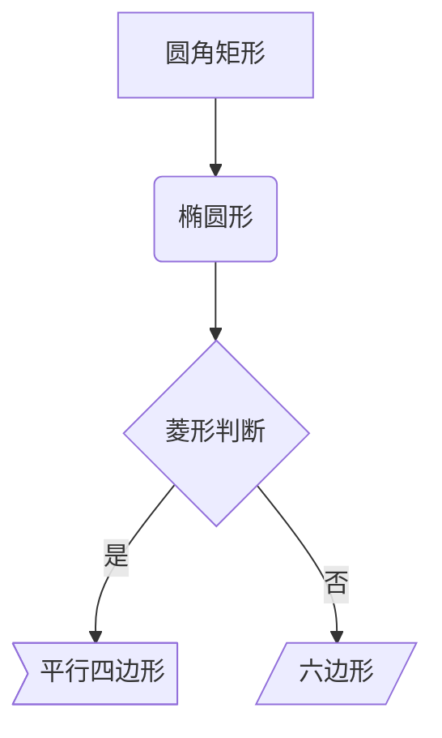
```

### 连接线

```markdown
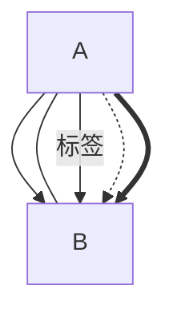
```

### 示例

```markdown
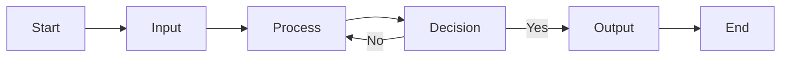
```

## 序列图

### 基本语法

```markdown
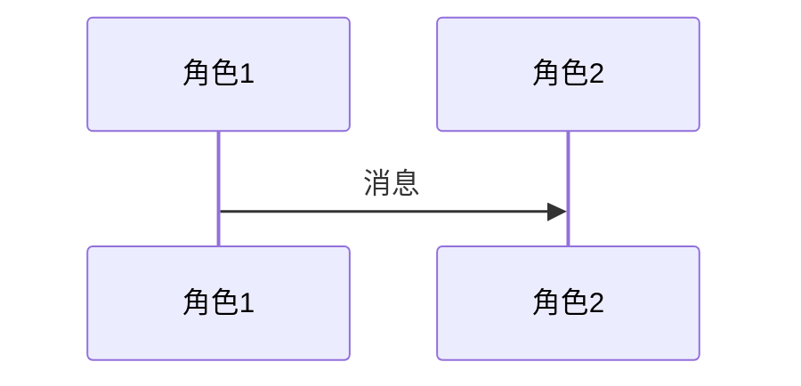
```

### 消息类型

```markdown
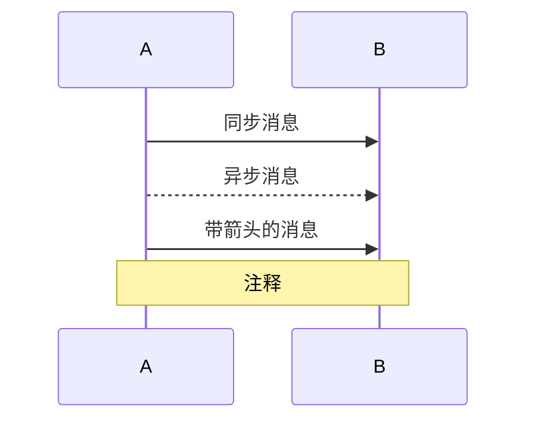
```

### 示例

```markdown
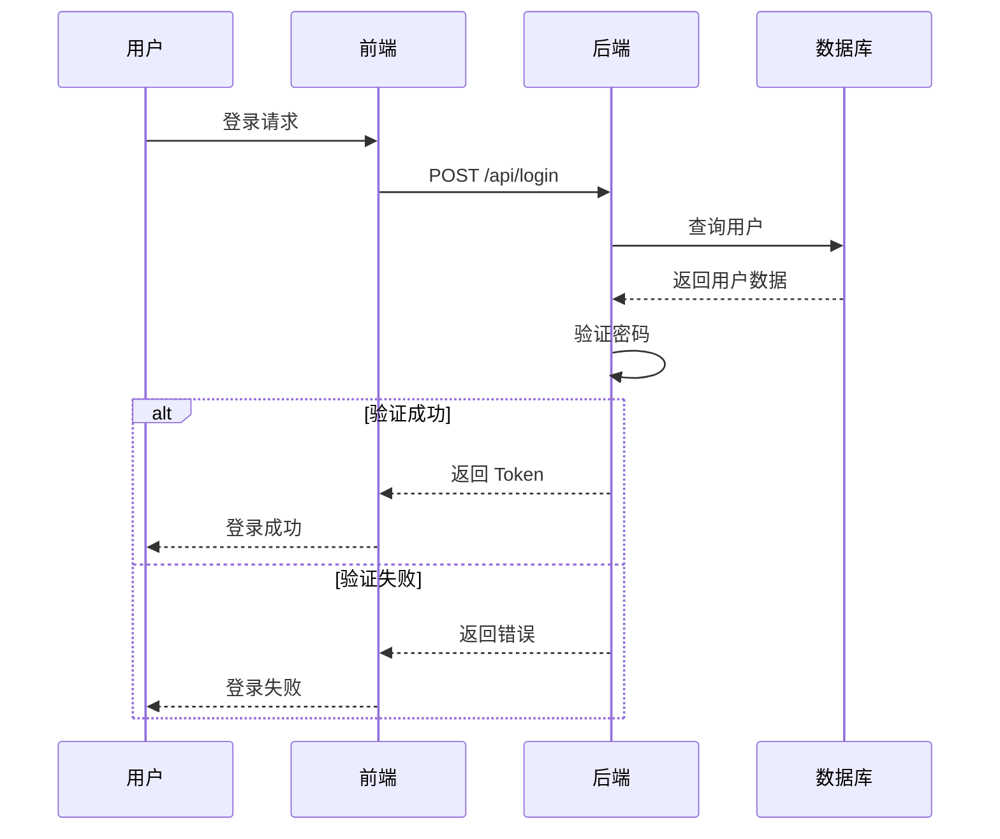
```

## 类图

### 基本语法

```markdown
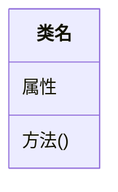
```

### 访问修饰符

```markdown
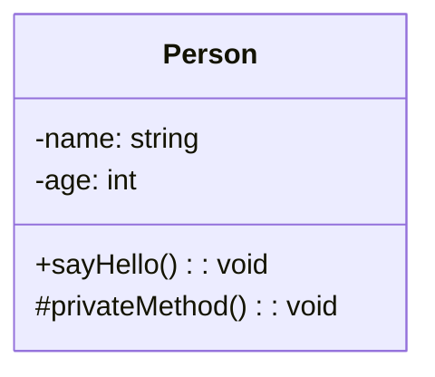
```

### 关系

```markdown
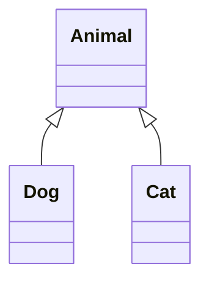
```

### 示例

```markdown
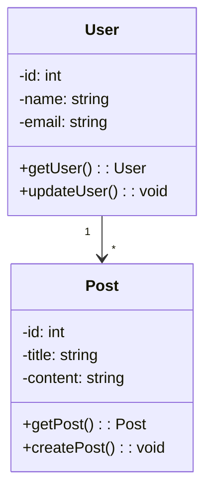
```

## 状态图

### 基本语法

```markdown
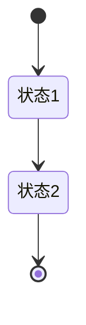
```

### 示例

```markdown
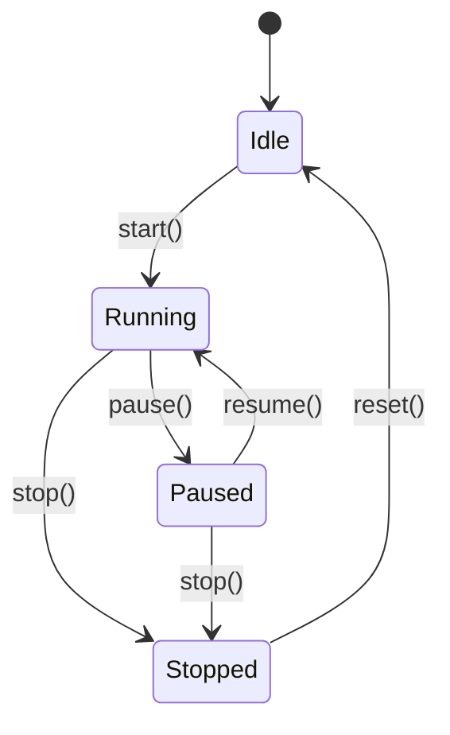
```

## 甘特图

### 基本语法

```markdown
```mermaid
gantt
  title 标题
  dateFormat 格式
  section 章节
  任务 :状态, 任务ID, 开始日期, 持续时间
```
```

### 日期格式

| 格式 | 说明 |
|------|------|
| YYYY-MM-DD | 年-月-日 |
| MM-DD | 月-日 |
| HH:mm | 时:分 |

### 任务状态

| 状态 | 说明 |
|------|------|
| done | 已完成 |
| active | 进行中 |
| future | 未开始 |

### 示例

```markdown
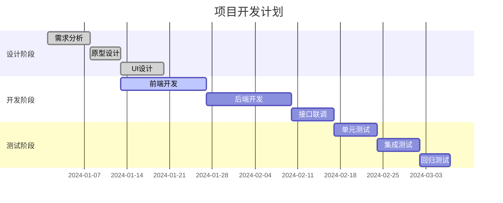
```

## 饼图

### 基本语法

```markdown

```

### 示例

```markdown
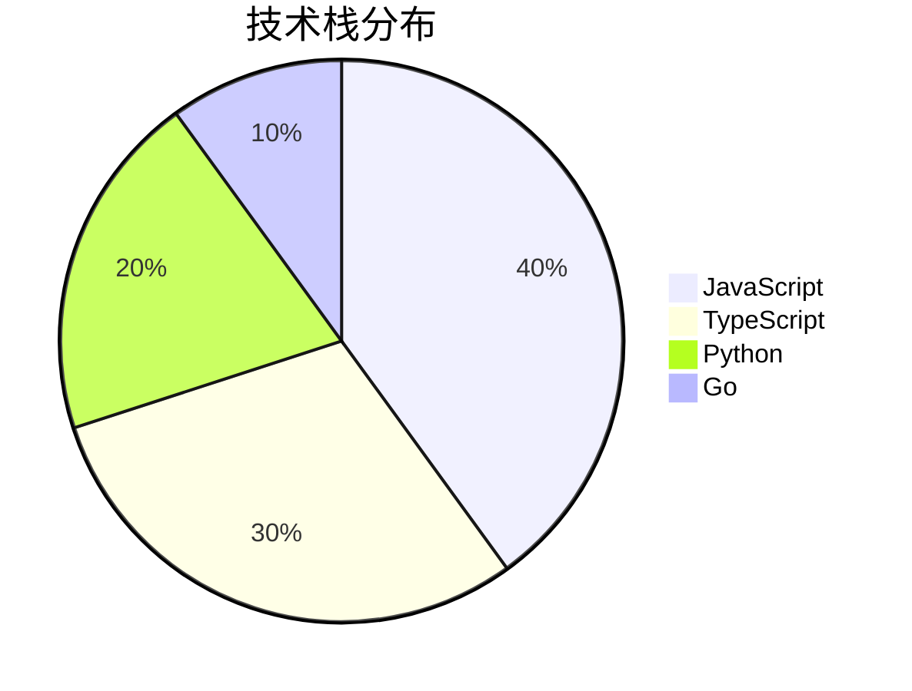
```

## 实体关系图

### 基本语法

```markdown
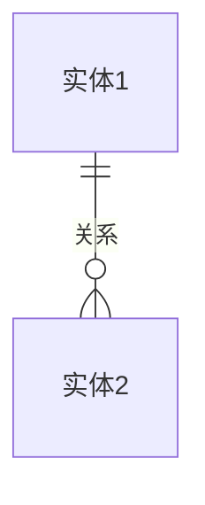
```

### 关系类型

| 符号 | 说明 |
|------|------|
| ||--|| | 一对一 |
| ||--o| | 一对多 |
| }o--|| | 多对一 |
| }o--o{ | 多对多 |

### 示例

```markdown
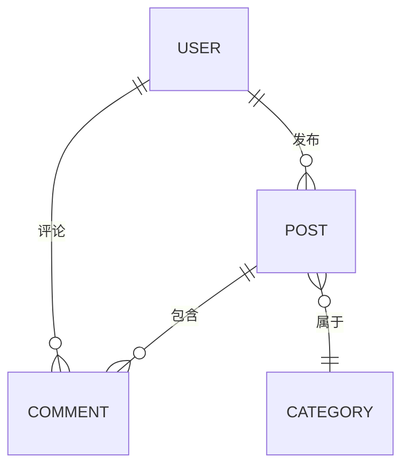
```

## 思维导图

### 基本语法

```markdown
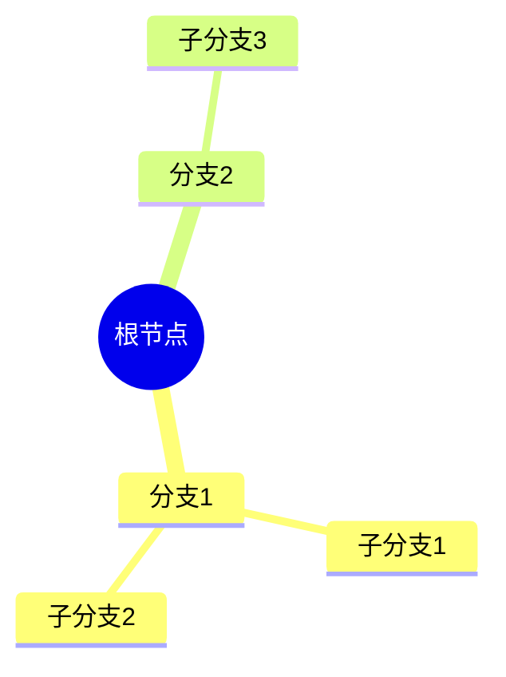
```

### 示例

```markdown
```mermaid
mindmap
  root((前端技术))
    HTML
      语义化标签
      表单
      多媒体
    CSS
      Flexbox
      Grid
      动画
    JavaScript
      ES6+
      异步编程
      模块化
    框架
      React
      Vue
      Svelte
```
```

## 用户旅程图

### 基本语法

```markdown
```mermaid
journey
  title 用户旅程
  section 阶段1
    步骤1: 描述
  section 阶段2
    步骤2: 描述
```
```

### 示例

```markdown
```mermaid
journey
  title 用户登录流程
  section 进入页面
    打开网站: 5: 非常容易
    找到登录按钮: 4: 容易
  section 登录
    输入用户名: 4: 容易
    输入密码: 4: 容易
    点击登录: 5: 非常容易
  section 完成
    登录成功: 5: 非常容易
    进入首页: 5: 非常容易
```
```

## 配置选项

### 主题配置

```markdown
```mermaid
%%{ init: { 'theme': 'dark' } }%%
flowchart TD
  A --> B
```
```

### 可用主题

| 主题 | 说明 |
|------|------|
| default | 默认主题 |
| dark | 暗黑主题 |
| forest | 森林主题 |
| neutral | 中性主题 |

### 自定义样式

```markdown
```mermaid
%%{ init: { 'themeVariables': { 'primaryColor': '#ff0000' } } }%%
flowchart TD
  A --> B
```
```

## 注意事项

### 渲染性能

复杂图表可能会影响页面加载性能，建议适度使用。

### 语法验证

确保 Mermaid 语法正确，错误的语法会导致渲染失败。

### 浏览器支持

Mermaid 在现代浏览器中都能正常渲染，旧版浏览器可能需要 polyfill。

## 扩展用法

### 子图

```markdown
```mermaid
flowchart TD
  subgraph 子图1
    A --> B
  end
  subgraph 子图2
    C --> D
  end
  B --> C
```
```

### 注释

```markdown
```mermaid
flowchart TD
  %% 这是一条注释
  A --> B
```
```

### 链接

```markdown
```mermaid
flowchart TD
  A["点击跳转"]
  click A "https://example.com" "链接说明"
```
```