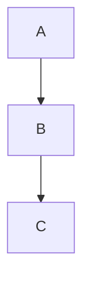
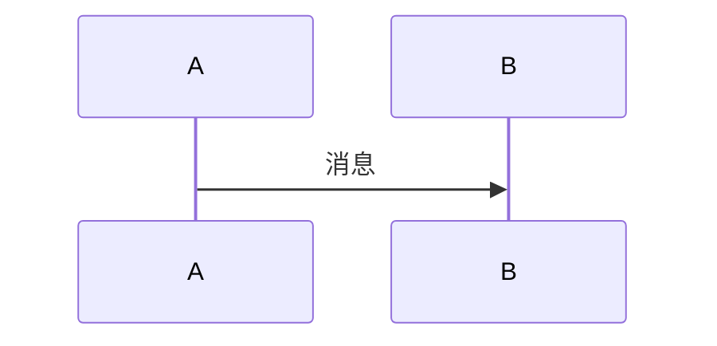
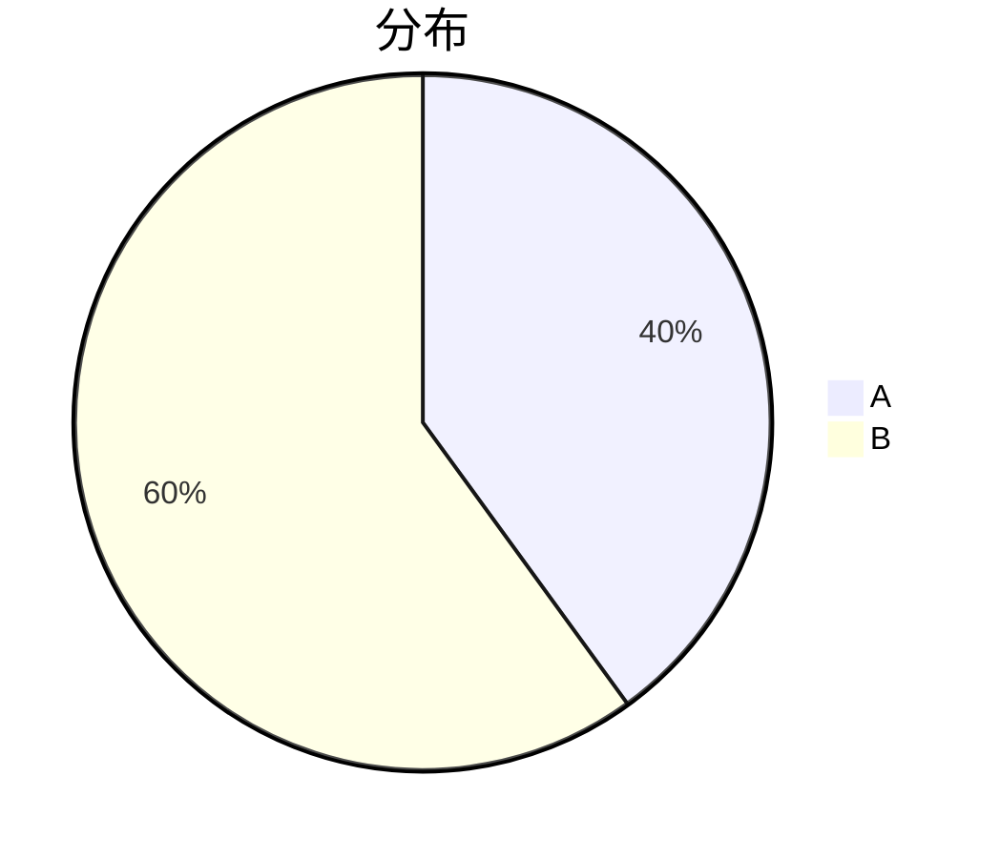

# 资源嵌入

## 图片嵌入

### 基本语法

```markdown

```

### 示例

```markdown

```

### 相对路径

```markdown

```

### 带标题的图片

```markdown

```

### 图片格式

推荐使用 WebP 格式，具有更好的压缩率：

```markdown

```

### 图片尺寸

通过 HTML 标签自定义尺寸：

```html

```

### 响应式图片

```html
<picture>
  <source srcset="/images/picture-320.webp 320w, /images/picture-640.webp 640w" />
  
</picture>
```

## 外部链接

### 基本语法

```markdown
[链接文本](URL)
```

### 示例

```markdown
[访问 GitHub](https://github.com)
```

### 带标题的链接

```markdown
[访问 GitHub](https://github.com "GitHub")
```

### 新窗口打开

```markdown
[访问 GitHub](https://github.com){:target="_blank"}
```

### 引用样式

```markdown
> 参考: [文章链接](https://example.com)
```

## 视频嵌入

### Bilibili

#### 基本用法

```markdown

```

#### 示例

```markdown

```

#### 自定义宽高

```markdown

```

### YouTube

#### 基本用法

```markdown

```

#### 示例

```markdown

```

#### 自定义宽高

```markdown

```

### 本地视频

```html
<video src="/videos/demo.mp4" controls width="800">
  Your browser does not support the video tag.
</video>
```

## 音乐嵌入

### 基本用法

```markdown

```

### 示例

```markdown

```

### 参数说明

| 参数 | 说明 |
|------|------|
| 歌曲名 | 显示的歌曲名称 |
| 歌手 | 歌手名称 |
| 封面URL | 封面图片地址 |
| 音频URL | 音频文件地址 |

## 代码块

### 基本语法

```markdown
```language
代码内容
```
```

### 示例

```markdown
```javascript
function hello() {
  console.log('Hello World');
}
```
```

### 支持的语言

支持多种编程语言：

```markdown
```typescript
const message: string = 'Hello';
```

```python
print("Hello World")
```

```rust
fn main() {
    println!("Hello");
}
```
```

### 行号显示

代码块默认显示行号：

```markdown
```javascript
// 行号会自动显示
console.log('Hello');
```
```

### 行高亮

```markdown
```javascript {2-4}
function hello() {
  console.log('Line 2');
  console.log('Line 3');
  console.log('Line 4');
}
```
```

## 文件下载

### 基本语法

```markdown
[下载文件](/files/document.pdf)
```

### 带图标

```markdown
[📄 下载文档](/files/document.pdf)
```

### 多个文件

```markdown
- [文档1](/files/doc1.pdf)
- [文档2](/files/doc2.pdf)
- [文档3](/files/doc3.pdf)
```

## 表格

### 基本语法

```markdown
| 列1 | 列2 | 列3 |
|-----|-----|-----|
| 内容 | 内容 | 内容 |
| 内容 | 内容 | 内容 |
```

### 对齐方式

```markdown
| 左对齐 | 居中对齐 | 右对齐 |
|:---|:---:|---:|
| 内容 | 内容 | 内容 |
```

### 复杂表格

```markdown
| 名称 | 描述 | 价格 |
|------|------|------|
| 产品A | 描述文字 | $100 |
| 产品B | 描述文字 | $200 |
| 产品C | 描述文字 | $300 |
```

## 数学公式

### 块级公式

```markdown
$$E = mc^2$$
```

### 行内公式

```markdown
质能方程是 $E = mc^2$。
```

### 复杂公式

```markdown
$$\int_{-\infty}^{\infty} e^{-x^2} dx = \sqrt{\pi}$$
```

## 图表

### Mermaid 流程图

```markdown

```

### Mermaid 时序图

```markdown

```

### Mermaid 饼图

```markdown

```

## 引用

### 基本语法

```markdown
> 引用内容
```

### 多层引用

```markdown
> 第一层引用
>
> > 第二层引用
> >
> > > 第三层引用
```

### 引用加作者

```markdown
> 这是一条引用。
> —— 作者名称
```

## 任务列表

### 基本语法

```markdown
- [x] 已完成任务
- [ ] 未完成任务
- [ ] 待办任务
```

### 嵌套任务

```markdown
- [x] 主任务
  - [x] 子任务1
  - [ ] 子任务2
- [ ] 主任务2
```

## 代码高亮

### 内联代码

```markdown
`const x = 1;`
```

### 代码块

```markdown
```javascript
const x = 1;
```
```

### 语法高亮

支持多种语言的语法高亮：

```markdown
```python
def hello():
    print("Hello")
```
```

## 注意事项

### 路径规范

- 使用相对路径引用资源
- 图片放在文章文件夹内
- 文件命名使用小写字母和连字符

### 性能优化

- 图片使用 WebP 格式
- 压缩图片大小
- 使用懒加载

### 兼容性

- 确保资源格式在所有浏览器中都能正常显示
- 提供备选方案

### 安全性

- 验证外部链接的安全性
- 避免引用不安全的资源

## 最佳实践

### 资源管理

- 将资源放在文章文件夹内
- 使用有意义的文件名
- 定期清理未使用的资源

### 图片优化

- 选择合适的图片格式
- 压缩图片大小
- 添加 alt 文本

### 链接管理

- 使用相对路径
- 定期检查链接有效性
- 添加链接标题