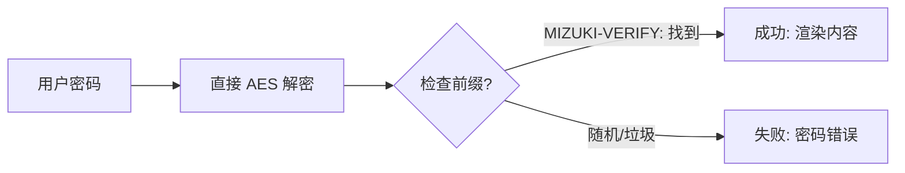

本博客模板使用 [Astro](https://astro.build/) 构建。对于本指南中未提及的内容，你可以在 [Astro 文档](https://docs.astro.build/) 中找到答案。

## 文章前置元数据

```yaml
---
title: 我的第一篇博客文章
published: 2026-03-15
description: 这是我的新 Astro 博客的第一篇文章。
image: ./cover.jpg
tags: [Foo, Bar]
category: 前端
draft: false
---
```

| 属性 | 描述 |
|------|------|
| `title` | 文章标题。 |
| `published` | 文章发布日期。 |
| `pinned` | 文章是否固定在文章列表顶部。 |
| `description` | 文章的简短描述。显示在首页。 |
| `image` | 文章的封面图片路径。<br/>1. 以 `http://` 或 `https://` 开头：使用网络图片<br/>2. 以 `/` 开头：使用 `public` 目录中的图片<br/>3. 无前缀：相对于 Markdown 文件的路径 |
| `tags` | 文章的标签。 |
| `category` | 文章的分类。 |
| `alias` | 文章的别名。文章将可以通过 `/posts/{alias}/` 访问。例如：`my-special-article`（将可通过 `/posts/my-special-article/` 访问） |
| `licenseName` | 文章内容的许可证名称。 |
| `author` | 文章的作者。 |
| `sourceLink` | 文章内容的源链接或参考。 |
| `draft` | 文章是否为草稿，草稿不会显示。 |
| `encrypted` | 文章是否受密码保护。 |
| `password` | ⚠️ **安全警告：禁止将明文密码写进 frontmatter 提交到 Git**。应通过环境变量 / 构建时密钥注入，并在 Encryptor.astro 中从 `Astro.locals` 或服务端 API 读取，而非 frontmatter。仅供开发期本地快速测试使用。 |
| `passwordHint` | ⚠️ **安全警告：避免给出与密码一致或过于明确的提示。该字段同样会出现在提交历史中，建议非必要不使用。** |

## 文章文件的放置位置

你的文章文件应该放在 `src/content/posts/` 目录中。你也可以创建子目录来更好地组织你的文章和资产。

```
src/content/posts/
├── post-1.md
└── post-2/
    ├── cover.png
    └── index.md
```

## 文章别名

你可以通过在前置元数据中添加 `alias` 字段为任何文章设置别名：

```yaml
---
title: 我的特殊文章
published: 2026-03-15
alias: "my-special-article"
tags: ["示例"]
category: "技术"
---
```

设置别名后：
- 文章将可以通过自定义 URL 访问（例如：`/posts/my-special-article/`）
- 默认的 `/posts/{slug}/` URL 仍然有效
- RSS/Atom 订阅将使用自定义别名
- 所有内部链接将自动使用自定义别名

**重要说明：**
- 别名不应包含 `/posts/` 前缀（会自动添加）
- 避免在别名中使用特殊字符和空格
- 为了最佳 SEO 实践，使用小写字母和连字符
- 确保别名在所有文章中是唯一的
- 不要包含前导或尾随斜杠

## 工作原理



## 页面加密

你可以通过设置 `encrypted: true` 并在前置元数据中提供 `password` 来为任何文章设置密码保护：

```yaml
---
title: 我的私人文章
published: 2026-03-15
encrypted: true
# ⚠️ 安全警告：以下字段仅作示例，不要提交包含明文密码的文件到 Git！
# 正确做法：通过环境变量 / 构建时密钥注入，或在 Encryptor 阶段读取本地密钥文件。
# password: "<通过非明文渠道注入>"
# passwordHint: "<仅在必要时提供不含敏感信息的通用提示>"
---
```

### 字段

| 字段 | 是否必需 | 描述 |
|------|----------|------|
| `encrypted` | 是 | 设置为 `true` 以启用密码保护 |
| `password` | 是 | 解锁文章的密码 |
| `passwordHint` | 否 | 显示在密码输入框下方的提示，帮助用户 |

### 解锁框外观

解锁框显示：
- 主题主色的锁图标
- 文章标题 "密码保护"
- 请求密码的描述
- 提示（如果提供了 `passwordHint`）
- 密码输入字段和解锁按钮

输入正确密码后，内容将被解密并显示。密码存储在会话存储中，因此用户在同一会话内的后续页面加载中不需要重新输入密码。